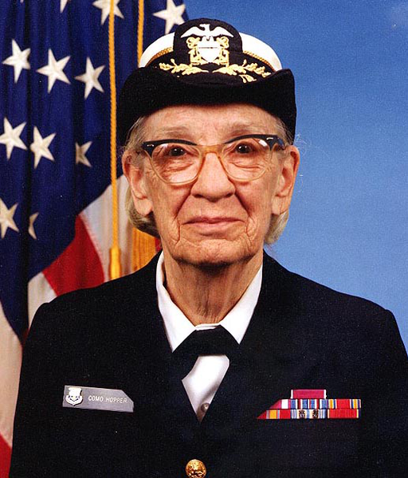

# NPU Usage

Teflon TFLite delegate is an [Mesa](https://docs.mesa3d.org/teflon.html) open-source Tensorflow Lite delegate used for hardware-accelerated inference on the Amlogic A311D SoC NPU.

To utilize the teflon delegate for NPU hardware-accelerated neural network inference, users need to use the [Armbian 6.8.7_xfce](https://dl.radxa.com/zero2pro/images/armbian/Armbian-unofficial_24.5.0-trunk_Radxa-zero2_bookworm_edge_6.8.7_xfce_desktop.img.gz) system provided by Radxa. Please follow the [install OS](../getting-started/install-os) guide to install this system.

## Install Teflon TFLite delegate
### Download precompiled delegate file
Teflon TFLite delegate has been precompiled and users can download and use it directly.
```bash
wget https://github.com/zifeng-radxa/zero2pro_NPU_example/releases/download/v1.0/libteflon.so
```

### Manual compilation (optional)
- Clone repository
```bash
git clone https://gitlab.freedesktop.org/tomeu/mesa.git -b teflon-staging --single-branch --depth=1
cd mesa
```
- Set up compilation environment
```bash
sudo apt install -y python3-pip python3.11-venv libdrm-dev libwayland-dev libwayland-egl-backend-dev libx11-dev libxext libxfixes-dev libxcb-glx0-dev libxcb-shm0-dev libx11-xcb-dev libxcb-dri2-0-dev libxcb-dri3-dev libxcb-present-dev libxshmfence-dev libxxf86vm-dev libxrandr-dev
python3 -m venv .venv
source .venv/bin/activate
pip3 install meson ninja mako pycparser
```

- Compile Teflon
```bash
meson setup build -Dgallium-drivers=etnaviv -Dvulkan-drivers= -Dteflon=true
meson compile -C build
```
- Path to the successfully compiled libteflon.so
```bash
mesa/build/src/gallium/targets/teflon/libteflon.so
```

## Using Teflon TFLite delegate
Users can refer to the [TensorFlow Lite delegate](https://www.tensorflow.org/lite/performance/delegates) documentation and [delegate usage documentation](https://www.tensorflow.org/lite/api_docs/python/tf/lite/experimental/load_delegate?hl=en) to understand the principles and usage of delegates. Using NPU acceleration requires running inference scripts as root user.

### MobileNet V1 Object Recognition Example
Here is an example of using Teflon delegate to use NPU inference MobileNet V1 object recognition model to recognite the contents of the following image.
 

- Get example code and model files
```bash
git clone https://github.com/zifeng-radxa/zero2pro_NPU_example.git
cd zero2pro_NPU_example
wget http://download.tensorflow.org/models/mobilenet_v1_2018_08_02/mobilenet_v1_1.0_224_quant.tgz
tar -xvf mobilenet_v1_1.0_224_quant.tgz
```

- Set up environment
```bash
python3 -m venv .venv
source .venv/bin/activate
pip3 install numpy pillow tflite-runtime
```

- Run example code

  Replace -e with the path to libteflon.so
```bash
python3 classification.py -i ./grace_hopper.bmp -m ./mobilenet_v1_1.0_224_quant.tflite -l labels_mobilenet_quant_v1_224.txt -e ./libteflon.so
```
```bash
(.venv) root@radxa-zero2:~/zero2pro_npu_example# python3 classification.py -i ./grace_hopper.bmp -m ./mobilenet_v1_1.0_224_quant.tflite -l labels_mobilenet_quant_v1_224.txt -e ./libteflon.so
Loading external delegate from ./libteflon.so with args: {}
0.909804: military uniform
0.019608: Windsor tie
0.007843: bulletproof vest                                                                                                                 
0.007843: mortarboard
0.003922: cornet
time: 6.256ms
```
- Compare the inference speed of the CPU to the NPU, NPU improves by 16 times
```bash
(.venv) root@radxa-zero2:~/zero2pro_npu_example# python3 classification.py -i ./grace_hopper.bmp -m ./mobilenet_v1_1.0_224_quant.tflite -l labels_mobilenet_quant_v1_224.txt 
0.917647: military uniform
0.015686: Windsor tie
0.007843: mortarboard
0.007843: bulletproof vest
0.003922: bow tie
time: 101.621ms
```
